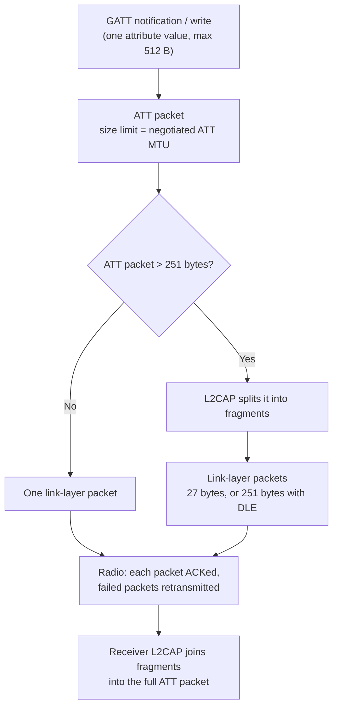

BLE has more than one packet size limit. Each limit applies to a different layer of the stack, so people often mix them up.

## The three limits at a glance

| Layer | Limit | Set by |
|---|---|---|
| Link layer payload | 27 B, or 251 B with DLE | Bluetooth Core Spec, same for every device |
| ATT packet | ATT MTU, 23 B default | MTU exchange at connection time |
| Attribute value | 512 B | Core Spec Vol 3, Part F, 3.2.9 |

## Other names for the same things

Datasheets, SDKs and forum posts use different words for these limits. Use this table to map a term to its layer.

| Layer | Other names you will see |
|---|---|
| Link layer payload | LL PDU payload, LL data length, maxTxOctets / maxRxOctets, Data Length Extension (DLE), "BLE packet size" |
| ATT packet | ATT_MTU, GATT MTU, "MTU", MaxPduSize (Windows), maximumWriteValueLength + 3 (Apple) |
| L2CAP | L2CAP SDU, segmentation and reassembly, fragmentation, ACL buffer size |
| Attribute value | Characteristic value length, GATT_MAX_ATTR_LEN, max attribute length |

When someone says "MTU" without a layer, they almost always mean the ATT MTU.

## Link layer

The link layer sends small packets. Each link-layer packet carries at most **27 bytes** of payload. With Data Length Extension (DLE), the limit increases to **251 bytes**.

This is the limit that people usually mean by "BLE packets are 27 to 251 bytes." It is the same for every device. No phone, laptop or chip sends a link-layer packet with more than 251 bytes of payload.

## ATT layer and MTU

The ATT layer sends larger packets. GATT notifications and writes travel as ATT packets. The **ATT MTU** sets the largest ATT packet that the two devices accept, and they agree on it at connection time. Each side states its maximum, and the connection uses the smaller value. The MTU is independent of the 251-byte link-layer limit.

## L2CAP connects the two layers

If an ATT packet is larger than 251 bytes, L2CAP splits it into several link-layer packets. The receiver joins the fragments into the full ATT packet again.

A 2000-byte notification therefore goes over the air as about **eight** link-layer packets, usually in one connection event.

## Fragmentation does not lose data

The link layer acknowledges each packet and retransmits failed ones. A failed fragment adds latency but does not corrupt the message.

## Cost of large packets

- The radio stays on longer in each connection event, which uses more power.
- Both devices need more ACL buffer memory to hold the fragments.

## The spec ceiling: 512 bytes

The Bluetooth Core Specification, Vol 3, Part F, Section 3.2.9, limits an attribute value to **512 bytes**. A notification carries one attribute value, so a spec-compliant notification is at most 512 bytes.

This is why most stacks stop at an ATT MTU of **517 bytes**: 512 bytes of value plus the largest ATT header (5 bytes, for a Prepare Write). An MTU above 517 gives no benefit to a spec-compliant peer.

## Limits on phones and laptops

These are ATT MTU limits. The link-layer limit is 251 bytes on all of them.

| Platform | ATT MTU | Notes |
|---|---|---|
| Android 14 and later | 517 | The stack requests 517 on the first `requestMtu()` call and ignores later requests. Result is `min(517, peer MTU)`. |
| Android 13 and earlier | Up to 517 | The app requests a value with `requestMtu()`. |
| iPhone / iPad (iOS) | 185 on many devices, 527 seen on newer ones | iOS starts the exchange. The app cannot set it. Read it with `maximumWriteValueLength(for:)`. Values change with model and iOS version. |
| Mac (macOS) | Set by the OS | Same CoreBluetooth API as iOS. The app cannot set it. |
| Windows 10 / 11 | Set by the OS | Negotiated before the app gets the connection. Read it with `GattSession.MaxPduSize`. |
| Linux (BlueZ) | Up to 517 | `BT_ATT_MAX_LE_MTU` is 517 in BlueZ. |

Do not hard-code these numbers in an app. Read the negotiated value after the connection and size each write to `MTU - 3` bytes.

## Why my 2000-byte notifications work

- Both ends run Zephyr, and Zephyr does not enforce the 512-byte limit.
- Both ends set a matching large MTU.
- A phone or PC central caps the MTU at about 517 bytes, so it would reject these notifications. For those centrals, keep notifications at 512 bytes or less.

## Summary

> **"BLE is limited to 251 bytes."**
>
> 251 bytes is the link-layer packet size. My 2000-byte MTU is at the ATT layer, and L2CAP splits it across link-layer packets.

## References

- [Android 14 behavior changes: ATT MTU 517](https://developer.android.com/about/versions/14/behavior-changes-all)
- [Apple Developer Forums: iOS MTU exchange](https://developer.apple.com/forums/thread/721541)
- [Nordic DevZone: iOS MTU 185 bytes](https://devzone.nordicsemi.com/f/nordic-q-a/44825/ios-mtu-size-why-only-185-bytes/176057)
- [Web Bluetooth discussion: MTU on Windows, macOS, Linux](https://lists.w3.org/Archives/Public/public-web-bluetooth-log/2020Feb/0004.html)
- [BlueZ att-types.h](https://coral.googlesource.com/bluez-imx/+/refs/tags/5.27/src/shared/att-types.h)
