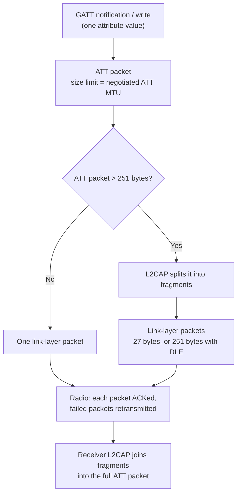

BLE has more than one packet size limit. Each limit applies to a different layer of the stack, so people often mix them up.

## Link layer

The link layer sends small packets. Each link-layer packet carries at most **27 bytes** of payload. With Data Length Extension (DLE), the limit increases to **251 bytes**.

This is the limit that people usually mean by "BLE packets are 27 to 251 bytes."

## ATT layer and MTU

The ATT layer sends larger packets. GATT notifications and writes travel as ATT packets. The **ATT MTU** sets the largest ATT packet that the two devices accept, and they agree on it at connection time. The MTU is independent of the 251-byte link-layer limit.

## L2CAP connects the two layers

If an ATT packet is larger than 251 bytes, L2CAP splits it into several link-layer packets. The receiver joins the fragments into the full ATT packet again.

A 2000-byte notification therefore goes over the air as about **eight** link-layer packets, usually in one connection event.

## Fragmentation does not lose data

The link layer acknowledges each packet and retransmits failed ones. A failed fragment adds latency but does not corrupt the message.

## Cost of large packets

- The radio stays on longer in each connection event, which uses more power.
- Both devices need more ACL buffer memory to hold the fragments.

## The spec ceiling: 512 bytes

The Bluetooth Core Specification, Vol 3, Part F, Section 3.2.9, limits an attribute value to **512 bytes**. A notification carries one attribute value, so a spec-compliant notification is at most 512 bytes.

## Why my 2000-byte notifications work

- Both ends run Zephyr, and Zephyr does not enforce the 512-byte limit.
- Both ends set a matching large MTU.
- A phone or PC central caps the MTU at about 517 bytes, so it would reject these notifications. For those centrals, keep notifications at 512 bytes or less.

## Interview answer

> **"BLE is limited to 251 bytes."**
>
> 251 bytes is the link-layer packet size. My 2000-byte MTU is at the ATT layer, and L2CAP splits it across link-layer packets.

| Layer | Limit | Set by |
|---|---|---|
| Link layer | 27 B, 251 B with DLE | Controller, DLE negotiation |
| ATT | ATT MTU | MTU exchange at connection |
| Attribute value | 512 B | Core Spec Vol 3, Part F, 3.2.9 |
| Phone / PC central | MTU about 517 B | OS BLE stack |
